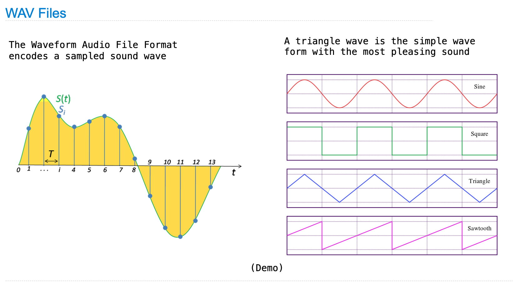

# All I want for Christmas is you:)

- Course: CS61A from UC Berkeley
- Description: compose a Christmas song using python
- Concept: high-order function, sound wave
- Contributed by: **Benny Cai**

## Notes
- **Christmas.py** is the code.
- **Christmas.wav** is the audio file generated by the code.  

- **What I did**: add musical notes, compose the song with melodies and rhythms. 
- **What I referenced from the source code**: the functions that generate the sound wave and play the song

## Triangle wave
The underlying sound wave for the song  

Screenshot referenced from the slides of CS61A Fall 2018

## License

    Copyright [2020] [Benny Cai]
    Copyright [John DeNero] [Instructor of CS61A Fall 2018]
